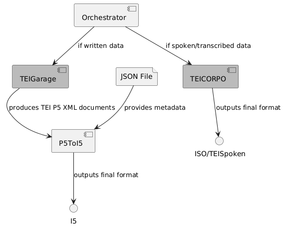

# TEIWorLD (TEI Workflow for Language Data)
Tool to convert several written and spoken language data formats into TEI 
## Description
TEIWorLD transforms a variety of different formats for spoken and written language into the standardised formats TEISpoken and I5 with the intermediate format TEI P5. For archiving written data, the pipeline converts TEI P5 to the format used at IDS, the I5 format, which was developed by IDS based on TEI P5. 

  

## Usage
Command **spoken**: 
Converts to TEIspoken and keeps files separate if there is more than one in the input directory 
`de.ids.TeiWorld spoken path\to\input\dir\ path\to\output\dir\`

Command **written**: 
Converts to TEI I5 and combines files to a single corpus in case there is more than one in the input directory. The file `metadata.json` needs to be in the same directory 
`de.ids.TeiWorld written path\to\input\dir\ path\to\output\dir\`

Command **writtenP5**: 
Converts to TEI I5 and keeps files separate if there is more than one in the input directory 
`de.ids.TeiWorld writtenP5 path\to\input\dir\ path\to\output\dir\`

Command **writtenHierarchical**: 
Converts to TEI I5 and constructs the hierarchical document and text structure of a written corpus. 
The directory needs to contain the file `metadata.json` and one or more subdirectories (= idsDoc) that contain the individual texts (= idsText). 
`de.ids.TeiWorld writtenHierarchical path\to\input\dir\ path\to\output\dir\`

### Components
[TEIGarage](https://github.com/TEIC/TEIGarage) 
[TEICORPO](https://github.com/christopheparisse/teicorpo) 
P5ToI5 
### Data formats
#### Input (spoken formats)
eaf (Elan) 
textgrid (Praat) 
cha (chat/childes) 
trs (transcriber) 
maxqda (qdpx/mx24) 
#### Input (written formats)
txt 
docx/doc 
#### Output
ISO/TEI Transcriptions of Spoken Language (TEISpoken) 
IDS TEI P5 (I5) 

## Publications

## Team

## Contact
* [E-Mail](mailto:data-steward@ids-mannheim.de)

<footer>
  

    
    
  

  
&copy; 2025 TEIWorLD

</footer>
